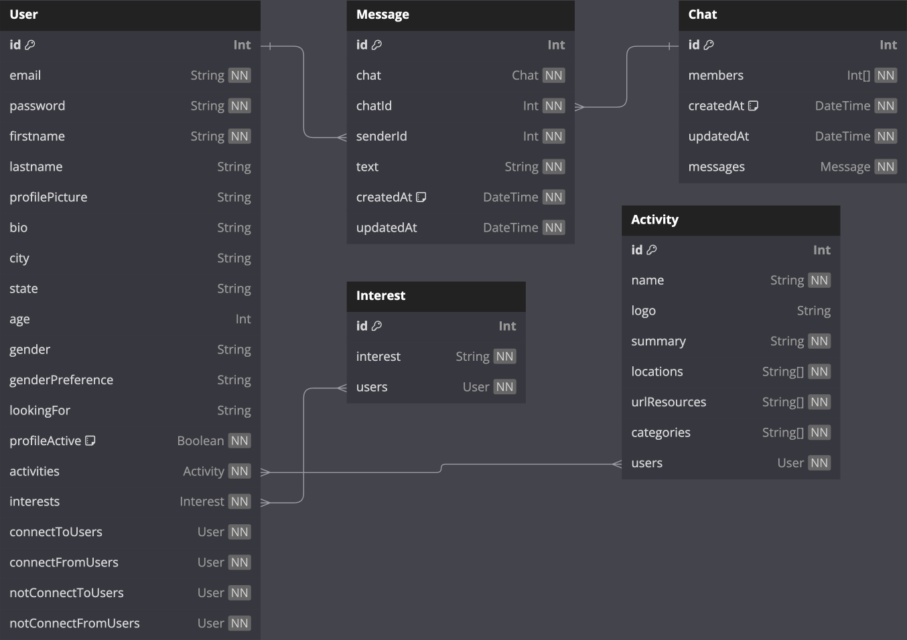

# Convene App Backend

Welcome to Convene, the newest app to find friends, that special someone, or a companion for a local event. Logged in users can add and edit information about themselves, add their interests, create a list of other liked users to connect with, one-to-one chat with other users, and add local activity types they might be interested in attending.

This repo includes the backend code for running the chat server, creating the database, and serving the API for Convene.

## Getting Started

### Set up the project locally

1. Install Node.js and npm: [Downloading and installing Node.js and npm](https://docs.npmjs.com/downloading-and-installing-node-js-and-npm)
2. Clone the repository locally: `git clone https://github.com/wangbertha/convene-app-frontend.git`
3. Install dependencies: `npm install`

### Set up the corresponding frontend

1. Follow the Getting Started instructions in the [Convene App frontend repository](https://github.com/wangbertha/convene-app-frontend)

### Set up a local database

1. Install [PostgreSQL](https://www.postgresql.org/), keeping the post at the default 5432, and noting down your password for future commands when prompted
2. Edit the `.env.example` file:
    - Remove `.example` from the filename so it becomes `.env`
    - Replace `[username]` and `[password]` with your PostgreSQL account information.
    - Populate the value for `JWT_SECRET` with any random string. Ex. `JWT_SECRET="ASD34LHIjaestl24ihv409H873wv#542"`
3. Create and seed the database:
    `npx prisma migrate reset`
4. Check the data and its contents. There should be 7 Activities, 0 Chat, 25 Interests, 0 Message, and 100 Users. The following command will open in your browser under port 5555:
    `npx prisma studio`

### Run the project locally

1. Run the project locally: `npm run dev`

## Database

The above diagram shows the various data tables and their relationships:

- User: stores all data related to the user profiles including login information, "likes", interests, and potential meetup activities

- Interest: stores a list of potential interests or hobbies that users can add to their profile. Users may also add interests if they are not already in the table. Also stores a list of all users who have added that interest to their profile.

- Activity: stores a list of activity suggestions for users to meet up (ex. hiking, getting coffee), as well as information to find out more about local options for that activity. Users are able to add activites they would be interested in to their profile. This table stores a list of all users who have added it.

- Message: Stores messages between users. Allows for persistent messages between browser sessions.

- Chat: Stores conversations between users, including all messages in the conversation. Allows persistent list of conversations for each user

## API

### Authentication Routes

- `POST /register` creates a new User with provided inputs and sends a token
    - Request body should include email, first name, and password
    - Password will be hashed in the database
- `POST /login` sends token if request credentials are correct
    - Request body should include email and password

### User Routes

User must be logged in for all routes:
- `GET /users` sends array of all users in the database
- `GET /me` sends currently logged-in user object with all information
- `GET /users/:id` sends all information relating to a specific user, including likes, interests, and activities
- `PATCH /me` allows the user to change information about their own profile, except for the password
    - Request body should include only the data to be changed about the user
- `PATCH /me/password` allows the user to update their password
    - Request body should include both the new and the old hashed password
- `DELETE /me` allows the user to delete their own account

### Interest Routes

- `GET /interests` sends array of all interests a user can add to their profile
- `POST /interests` allows a logged-in user to add a new interest to the table if it does not already exist

### Activity Routes

- `GET /activities` sends array of all currently available activity suggestions a user can add to their profile
- `GET /activities/:id` sends all information relating to a specific activity
- `PATCH /activities/:id` allows a logged-in user to add or remove an activity from their profile

### Message Routes

- `GET /messages/:id` sends all messages for a given chatId to a logged-in user
- `POST /messages` saves all messages a logged-in user sends on the server
    - each message request should contain the chatId, senderId, and text content
    - allows for persistent messaging across browser sessions

### Chat Routes

User must be logged in for all routes:
- `GET /chat/user-chats` sends all conversations the logged-in user is involved with
    - used to show conversation list
- `GET /chat/:id` sends the specific conversation bewtween the logged-in user and another user
    - request body should include the logged-in userId and the target userId
- `POST /chat` creates a new conversation between two users if one does not already exist
    - request body should include the logged-in userId and the target userId
